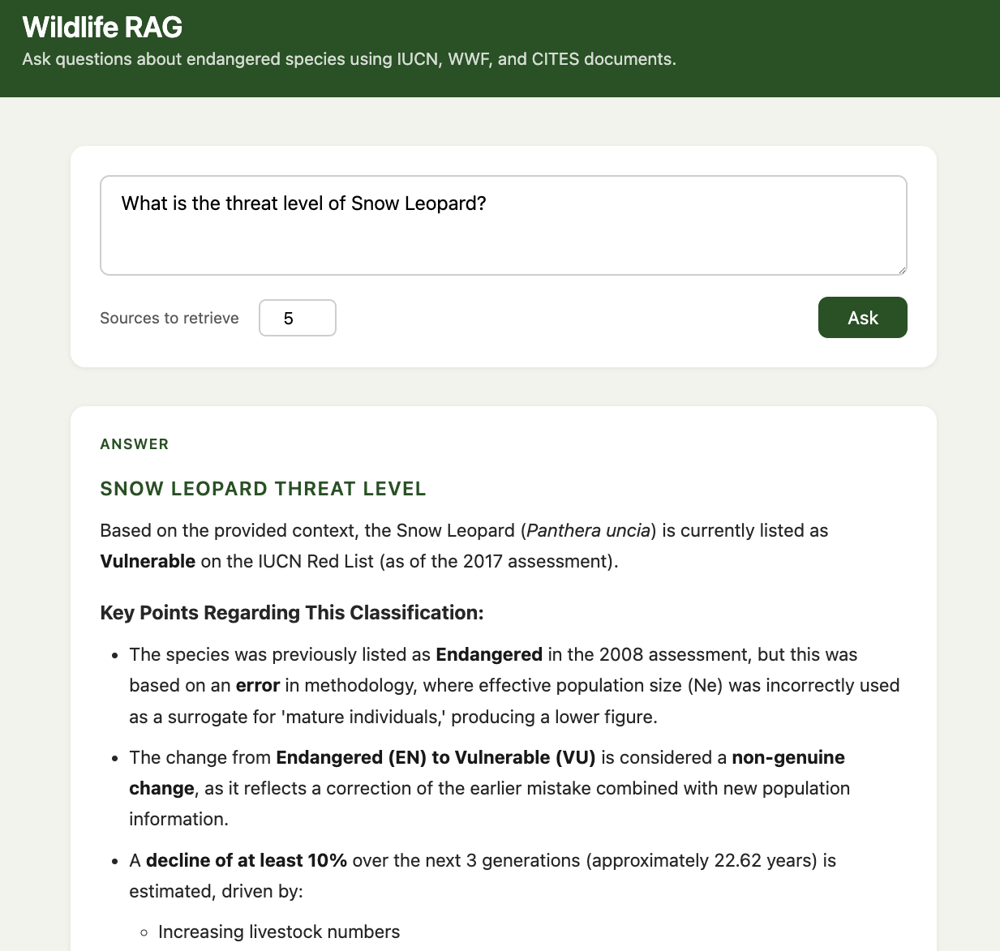
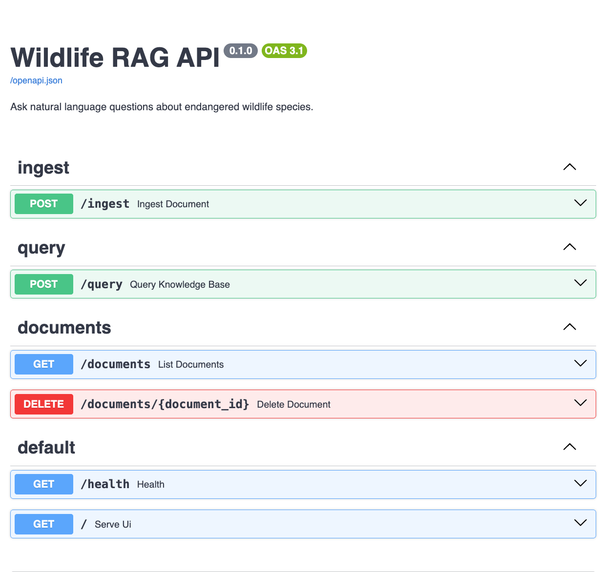

# Wildlife RAG API

A Retrieval-Augmented Generation (RAG) API for querying endangered wildlife species data using natural language. Upload conservation documents — IUCN Red List assessments, WWF species factsheets, CITES appendices — and ask questions against them. The API finds the most relevant passages and uses Claude to synthesize a grounded answer, citing its sources.

---

## Architecture

```
                        INGESTION
  ┌──────────┐    ┌───────────────┐
  │ PDF / TXT│───▶│ Text extract  │──┐
  └──────────┘    └───────────────┘  │   ┌──────────────┐    ┌────────────┐
                                     ├──▶│  Chunker     │───▶│  Embedder  │
  ┌──────────┐    ┌───────────────┐  │   │ (~500 tokens │    │  (OpenAI)  │
  │ IUCN API │───▶│ fetch_iucn.py │──┘   │  50 overlap) │    └─────┬──────┘
  └──────────┘    └───────────────┘      └──────────────┘          │
                                                                    ▼
                                                            ┌───────────────┐
                                                            │  PostgreSQL   │
                                                            │  + pgvector   │
                                                            └───────┬───────┘
                        QUERYING                                    │
  ┌──────────┐    ┌───────────────┐    ┌──────────────┐            │
  │ Question │───▶│   Embedder    │───▶│  Similarity  │◀───────────┘
  └──────────┘    │   (OpenAI)    │    │  search      │
                  └───────────────┘    └──────┬───────┘
                                              │ top-k chunks
                                              ▼
                                       ┌───────────────┐    ┌──────────┐
                                       │ Prompt builder│───▶│  Claude  │───▶ Answer
                                       └───────────────┘    └──────────┘
```

---

## Screenshot





**Live demo:** [animal-refuge-production.up.railway.app](https://animal-refuge-production.up.railway.app)

---

## Stack

| Layer | Technology |
|---|---|
| API framework | FastAPI |
| Database | PostgreSQL 16 + pgvector |
| ORM | SQLAlchemy 2 (async) |
| Migrations | Alembic |
| Embeddings | OpenAI `text-embedding-3-small` |
| LLM | Anthropic Claude (`claude-sonnet-4-6`) |
| PDF extraction | pdfplumber |
| Containerisation | Docker + Docker Compose |

---

## Quick start

**Prerequisites:** Docker, Python 3.12+, an OpenAI API key, an Anthropic API key.

```bash
# 1. Clone and enter the project
git clone <repo-url>
cd animal-refuge

# 2. Configure environment
cp .env.example .env
# Open .env and fill in ANTHROPIC_API_KEY and OPENAI_API_KEY

# 3. Start PostgreSQL with pgvector
docker-compose up -d

# 4. Install Python dependencies
pip install -r requirements.txt

# 5. Create tables
alembic upgrade 0001

# 6. Drop your documents into /documents, then seed them
python scripts/seed.py

# 7. Rebuild the embedding index on real data
alembic upgrade head

# 8. Start the API
uvicorn app.main:app --reload
```

Interactive API docs: **http://localhost:8000/docs**

---

## Example

**Ingest a document**

```bash
curl -X POST http://localhost:8000/ingest \
  -F "file=@documents/iucn_snow_leopard.pdf" \
  -F "source=IUCN"
```

```json
{
  "document_id": "a3f1c2d4-...",
  "filename": "iucn_snow_leopard.pdf",
  "chunks_created": 38
}
```

**Ask a question**

```bash
curl -s -X POST http://localhost:8000/query \
  -H "Content-Type: application/json" \
  -d '{"question": "What are the main threats facing snow leopards?", "top_k": 5}' \
  | jq .
```

```json
{
  "answer": "Snow leopards face several major threats: habitat loss due to expanding livestock grazing, retaliatory killing by herders following livestock depredation, poaching for the illegal wildlife trade (pelts and bones used in traditional medicine), and prey base depletion. Climate change is an emerging long-term threat projected to shrink suitable high-altitude habitat significantly over coming decades.",
  "sources": [
    {
      "document": "iucn_snow_leopard.pdf",
      "chunk_index": 7,
      "relevance_score": 0.934
    },
    {
      "document": "iucn_snow_leopard.pdf",
      "chunk_index": 12,
      "relevance_score": 0.891
    }
  ]
}
```

---

## API reference

| Method | Path | Description |
|---|---|---|
| `POST` | `/ingest` | Upload a PDF or TXT document (multipart) |
| `POST` | `/ingest/text` | Ingest plain text content (JSON) |
| `POST` | `/query` | Ask a natural language question |
| `GET` | `/documents` | List all ingested documents |
| `DELETE` | `/documents/{id}` | Remove a document and all its chunks |
| `GET` | `/health` | Health check |

---

## Seed documents

**Option 1 — local files:** place PDF or TXT files in `/documents` and run `scripts/seed.py`. The script auto-detects the source tag from the filename (e.g. a file containing `iucn` gets tagged as `IUCN`).

**Option 2 — IUCN Red List API:** fetch all latest global assessments for a taxonomic family in one command:

```bash
# requires IUCN_API_KEY in .env
python scripts/fetch_iucn.py --family Felidae

# run against a deployed instance
API_BASE=https://your-app.railway.app python scripts/fetch_iucn.py --family Felidae
```

The demo knowledge base contains all 39 species in the family Felidae (wild cats) sourced from the IUCN Red List API v4.

---

## Project structure

```
app/
├── main.py               # FastAPI entry point
├── config.py             # Settings via pydantic-settings
├── database.py           # Async SQLAlchemy engine + session
├── models/
│   ├── document.py       # Document ORM model
│   └── chunk.py          # Chunk ORM model with vector column
├── routers/
│   ├── ingest.py         # POST /ingest
│   ├── query.py          # POST /query
│   └── documents.py      # GET + DELETE /documents
├── services/
│   ├── chunker.py        # Token-aware text splitting
│   ├── embedder.py       # OpenAI embedding calls
│   └── retriever.py      # pgvector similarity search
└── prompts/
    └── qa.py             # System prompt + message builder
alembic/                  # Database migrations
documents/                # Place seed documents here
scripts/
├── seed.py               # Bulk ingest from /documents
└── fetch_iucn.py         # Fetch IUCN Red List assessments by taxonomic family
```
